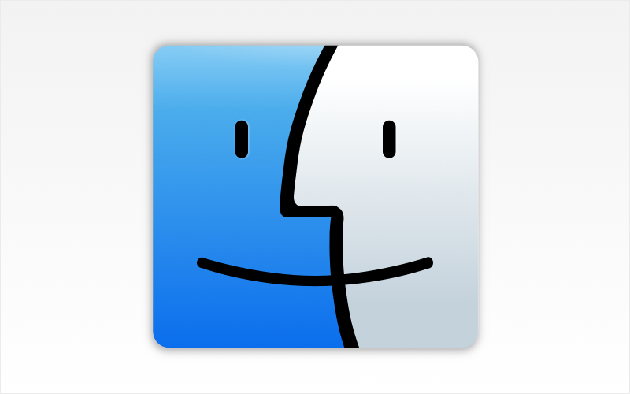
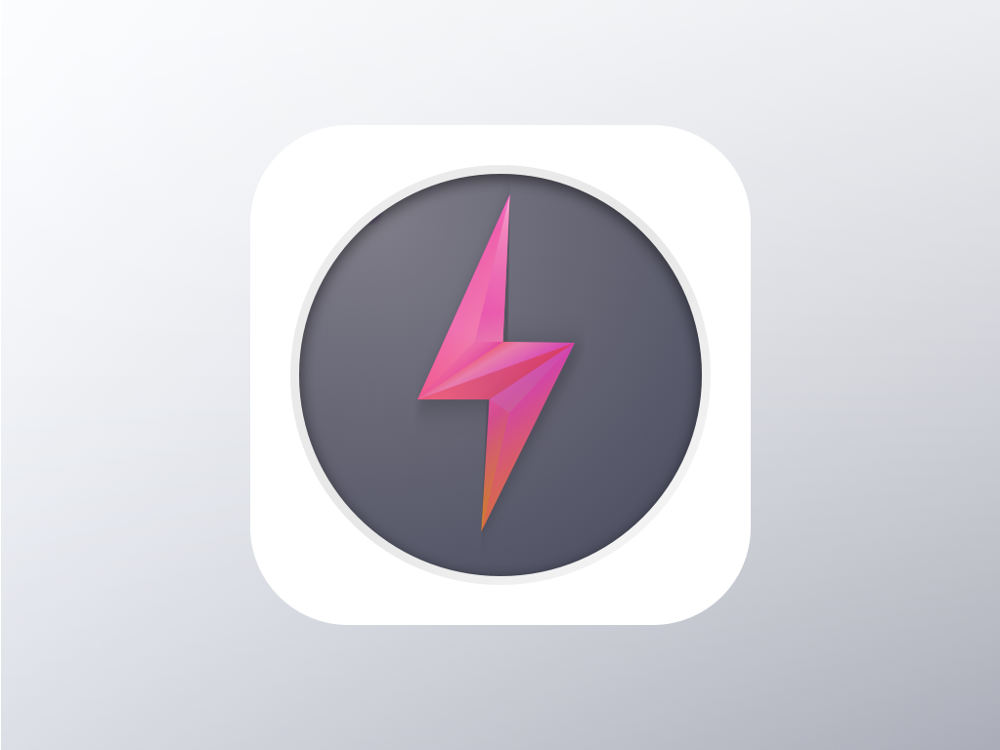

#Sketch icons
Using Sketch make a icon with joy of creation. 

This project inspired by [dailyicons](https://github.com/turingou/dailyicons), which contains every icon's source file, output file. all icons under MIT license, easy to reuse or redesign for your own purpose.

## Icons

All icons list below are located in `./icons` folder.
#### No.6 Inbox (11/11/2014)

#### No.5 Finder (11/02/2014)

#### No.4 Falsh (11/01/2014)

#### No.3 Calendar (10/26/2014)

#### No.2 Flat Mail (06/20/2014)

#### No.1 iOS style button (06/19/2014)

License:
-------------------
(The MIT License)

Copyright (c) 2014 [阿树](http://aaaaaashu.me/) 

Permission is hereby granted, free of charge, to any person obtaining
a copy of this software and associated documentation files (the
'Software'), to deal in the Software without restriction, including
without limitation the rights to use, copy, modify, merge, publish,
distribute, sublicense, and/or sell copies of the Software, and to
permit persons to whom the Software is furnished to do so, subject to
the following conditions:

The above copyright notice and this permission notice shall be
included in all copies or substantial portions of the Software.

THE SOFTWARE IS PROVIDED 'AS IS', WITHOUT WARRANTY OF ANY KIND,
EXPRESS OR IMPLIED, INCLUDING BUT NOT LIMITED TO THE WARRANTIES OF
MERCHANTABILITY, FITNESS FOR A PARTICULAR PURPOSE AND NONINFRINGEMENT.
IN NO EVENT SHALL THE AUTHORS OR COPYRIGHT HOLDERS BE LIABLE FOR ANY
CLAIM, DAMAGES OR OTHER LIABILITY, WHETHER IN AN ACTION OF CONTRACT,
TORT OR OTHERWISE, ARISING FROM, OUT OF OR IN CONNECTION WITH THE
SOFTWARE OR THE USE OR OTHER DEALINGS IN THE SOFTWARE.LIABILITY, WHETHER IN AN ACTION OF CONTRACT, TORT OR OTHERWISE, ARISING FROM,
OUT OF OR IN CONNECTION WITH THE SOFTWARE OR THE USE OR OTHER DEALINGS IN THE
SOFTWARE.
